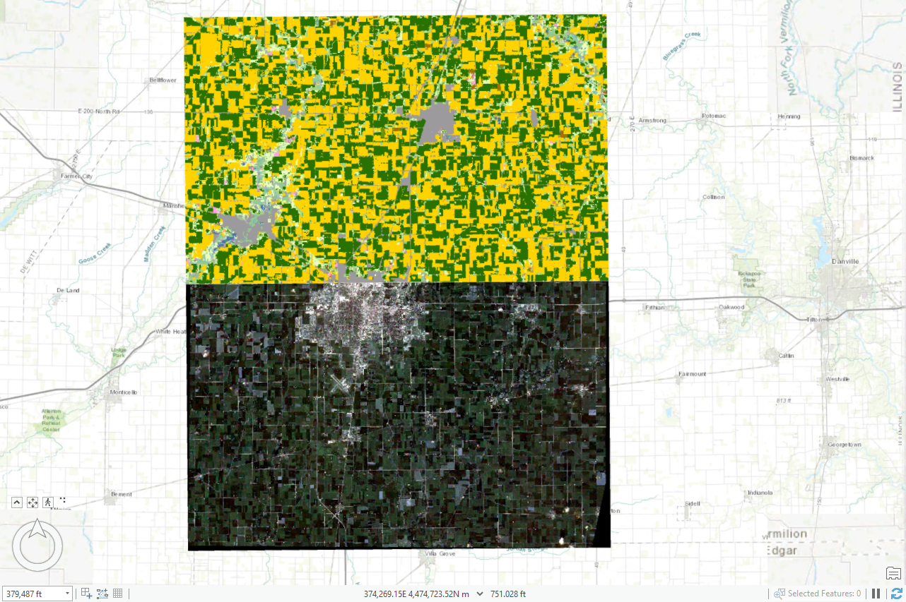
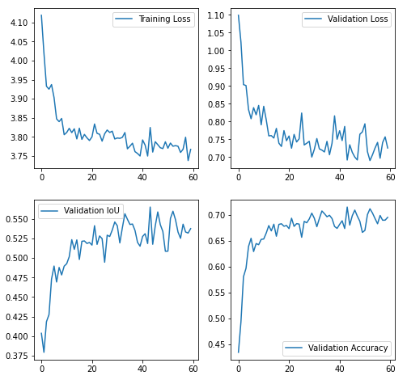
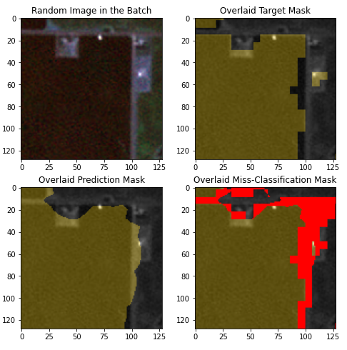
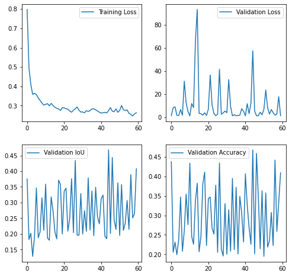
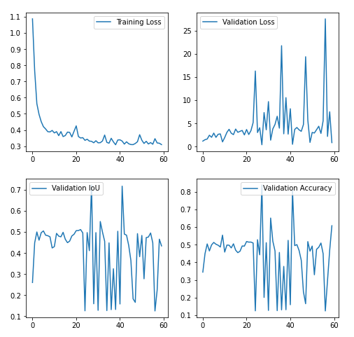
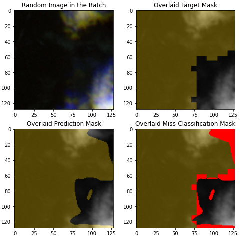

# RapidSeg

Naïve semantic segmentation model on a small subset of the `RapidEye` dataset.

## Requirements

`torch==1.7.0`

`tqdm~=4.50.2`

`numpy~=1.19.2`

`rasterio==1.1.8` Processing Geospatial data in a Pythonic way

`torchvision~=0.8.1` Out-of-shelf models with pretraining

`albumentations~=0.5.2` Easy augmentation for data with masks, bounding boxes, or keypoints

## File Structure

```
├───data -> cropped tiles of the raster data (generated by src/preprocessing.py)
│   ├───test
│   ├───train
│   └───train_mask
├───figures
├───saved_models
└───src
    ├───dataset.py -> dataloader
    ├───magic.ipynb -> data augmentation, training loops, and visualization
    ├───models.py -> FCN wrapper and UNet
    ├───params.py -> file paths, magic numbers, and hyperparameters
    ├───preprocessing.py -> crop the raster into tiles
    ├───unet_parts.py
    ├───utils.py -> code for visualization
```


## Simple Exploratory Data Analysis



### Dataset Information

| Dataset           | 20130824_RE3_3A_Analytic_Champaign_north (Training)          |
| ----------------- | ------------------------------------------------------------ |
| Vertical Unit     | Meter                                                        |
| Columns           | 9425                                                         |
| Rows              | 5959                                                         |
| Number of Bands   | 5 (R, G, B, Red Edge, and Near Infrared)                     |
| Data Type         | `uint16`                                                     |
| Channel-wise Mean | [5188.78934685, 4132.74818647, 2498.34747813, 3689.04702811, 11074.86217434] |
| Channel-wise Std  | [1482.89729162, 1447.21062441, 1384.91231294, 1149.82168184, 2879.24827197] |

| Dataset           | 20130824_RE3_3A_Analytic_Champaign_north (Training Mask) |
| ----------------- | -------------------------------------------------------- |
| Vertical Unit     | Meter                                                    |
| Columns           | 9425                                                     |
| Rows              | 5959                                                     |
| Number of Bands   | 1 (Labels)                                               |
| Data Type         | `uint8`                                                  |
| Number of Classes | 255                                                      |
| Class of Interest | Corn (1), Soybeans(5)                                    |
| Class Balance     | Corn: 45.08% \| Soybean 38.13% \| Others 16.78%          |

Note: "Soybeans" class is encoded as 2 while "Others" class is encoded as 0.

| Dataset         | 20130824_RE3_3A_Analytic_Champaign_south (Testing, No Label) |
| --------------- | ------------------------------------------------------------ |
| Vertical Unit   | Meter                                                        |
| Columns         | 9425                                                         |
| Rows            | 5959                                                         |
| Number of Bands | 5 (R, G, B, Red Edge, and Near Infrared)                     |
| Data Type       | `uint16`                                                     |

## Preprocessing

Run `src/preprocessing.py` to chop the raster into smaller tiles with designated size and recalculate the meta data for each tile (width, height, channel information, coordinate affine transformation matrix). Note: Preprocessing doesn't split the bands. They are selected in the dataloader with two options: RGB only and full bands. `Rasterio` reads the `GeoTiff` file in `CHW` order but `torchvision` transformation, `matplotlib`, and `albumentations` assume `HWC` order. The transformation is done in the dataloader with `NumPy`.

## Models and Training

> All models are wrong, but some are useful

### Models

1. FCN with Resnet 101 backbone
2. UNet with VGG backbone with Batch Normalization

Note: The FCN implementation uses bilinear interpolation instead of transposed convolution to perform upsampling but the difference seems to be ignorable.

### Training

> Note: Training loops are in `src/magic.ipynb`

1. Loss Function: 2D Cross Entropy Loss

2. Optimizer: RAdam, LookAhead, and Gradient Centralization combined

3. Other Techniques: Intermediate Supervision

4. Hyperparameters

   | Learning Rate                 | 1e-3  |
   | ----------------------------- | ----- |
   | $\alpha$                      | 0.5   |
   | $\beta_1$                     | 0.95  |
   | $\beta_2$                     | 0.999 |
   | $\epsilon$                    | 11-5  |
   | Maximum Simple Moving Average | 5     |
   | Weight Decay                  | None  |

### Results

> Note: The accuracy in the chart is the global pixel-wise accuracy. Corn layer has yellow-ish mask and soybean layer has green-ish mask

1. FCN trained with RGB bands with Resnet 101 backbone (pretrained on ImageNet and finetuned on Coco)

   + Training Curve

   

   + Validation Sample

     

2. FCN trained with all five bands with Resnet 101 backbone (without pretraining)

   + Training Curve

   

   + Validation Sample

     

   

3. UNet (without pretraining)

   + Training Curve

     

   + Validation Sample

     

## Potential Improvement

1. Explore more data augmentation options
2. Use `DALI` to speed up the data feeding pipeline
3. Find backbones pretrained on satellite images
4. Use weighted cross entropy to suppress the obsession of the "Corn" class
5. Use Class Activation Mapping methods to figure out what features the network is learning

